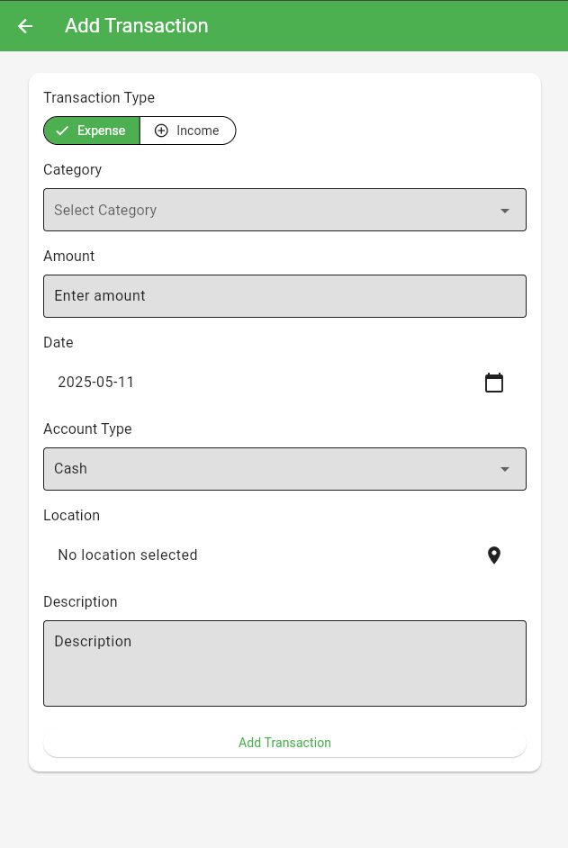

# Ikigai Money — Expense Tracker

Ikigai Money is a modern, cross-platform expense tracker app built with Flutter. It helps you manage your personal finances, track expenses and income, visualize statistics, and supports full localization in English, Russian, and Kazakh.

## Features
- **Multi-language support:** English, Russian, Kazakh (Қазақша)
- **Authentication:** Email/password, Google, Microsoft
- **Transaction Management:**
  - Add, edit, and delete expenses and income
  - Categorize transactions (Food, Transport, Utilities, etc.)
  - Attach location to transactions (with map selection)
  - Add notes and descriptions
  - Choose account type (Cash, Card)
- **Budgeting:**
  - Set and track monthly budget
  - View current balance, cash, and card balances
- **Statistics & Analytics:**
  - Visualize expenses and income by category
  - Monthly overview and net balance
  - Pie and bar charts for spending/income trends
  - Filtering and sorting (by date, amount, category, etc.)
- **Currency Converter:**
  - Convert between currencies
  - View exchange rates
- **Theming:**
  - Light and dark mode
  - Responsive and modern UI/UX
- **Data Management:**
  - Local storage (SQLite)
  - Firebase integration (for authentication and backup)
- **Other:**
  - Profile management (edit name, currency, profile picture)
  - Remove account and all data
  - Map integration for transaction locations

## Getting Started
1. **Clone the repository:**
   ```sh
   git clone https://github.com/ValliKaz/IkigayMoney.git
   cd expense_tracker_final
   ```
2. **Install dependencies:**
   ```sh
   flutter pub get
   ```
3. **Generate localization files:**
   ```sh
   flutter gen-l10n
   ```
4. **Run the app:**
   ```sh
   flutter run
   ```

## Screenshots

### Light Theme
| Home            | Add Transaction | Statistics      | Settings        |
|-----------------|----------------|----------------|----------------|
|  |  |  |  |
| Login            | Register | Map Selection      | Profile Info        |
|  |  |  |  |

## Localization
The app supports three languages. You can switch the language from the login or settings screen.

- English
- Русский
- Қазақша

## Main Functions & Properties
- **Transaction CRUD:** Add, edit, delete transactions
- **Category Management:** Localized categories for all supported languages
- **Account Types:** Cash, Card (with separate balances)
- **Budgeting:** Set and validate monthly budget
- **Statistics:**
  - `statistics`, `monthlyOverview`, `ofBudgetUsed`, `spent`, `incomeVsExpenses`, `expensesByCategory`, `incomesByCategory`, `netBalance`, `allCategories`, `sort`, `sortByCategory`, `sortByAmount`, `filter`, `search`, `selectDate`, `noTransactions`
- **Currency Converter:**
  - `currencyConverter`, `exchangeRates`, `currency`, `buy`, `sell`, `convertCurrency`, `fromCurrency`, `toCurrency`
- **Localization:**
  - All UI strings, category names, and prompts are localized
- **Authentication:**
  - Email/password, Google, Microsoft
- **Profile:**
  - Name, email, currency, profile picture
- **Map Integration:**
  - Select and display transaction location
- **Settings:**
  - Theme switching, language switching, data management, account deletion

## Contact

ValliKaz - [@ValliKaz](https://github.com/ValliKaz)

Project Link: [https://github.com/ValliKaz/IkigayMoney](https://github.com/ValliKaz/IkigayMoney)
